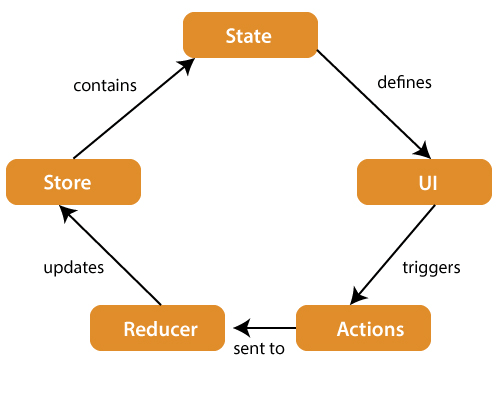
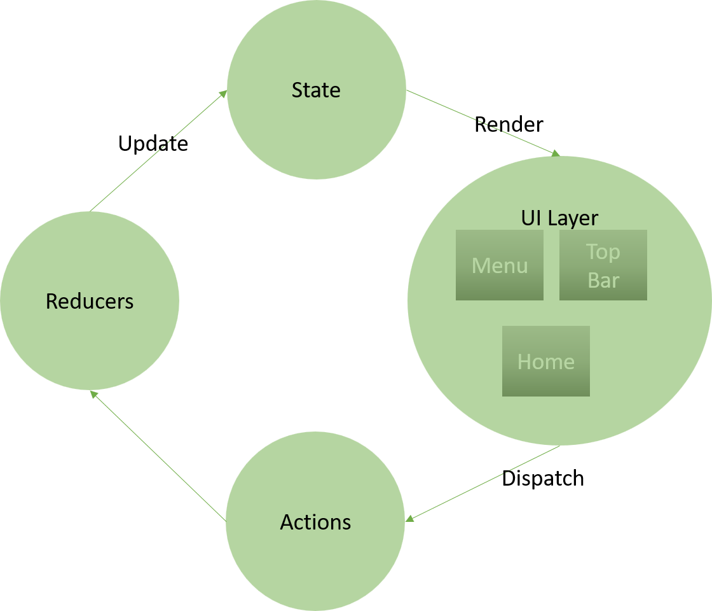
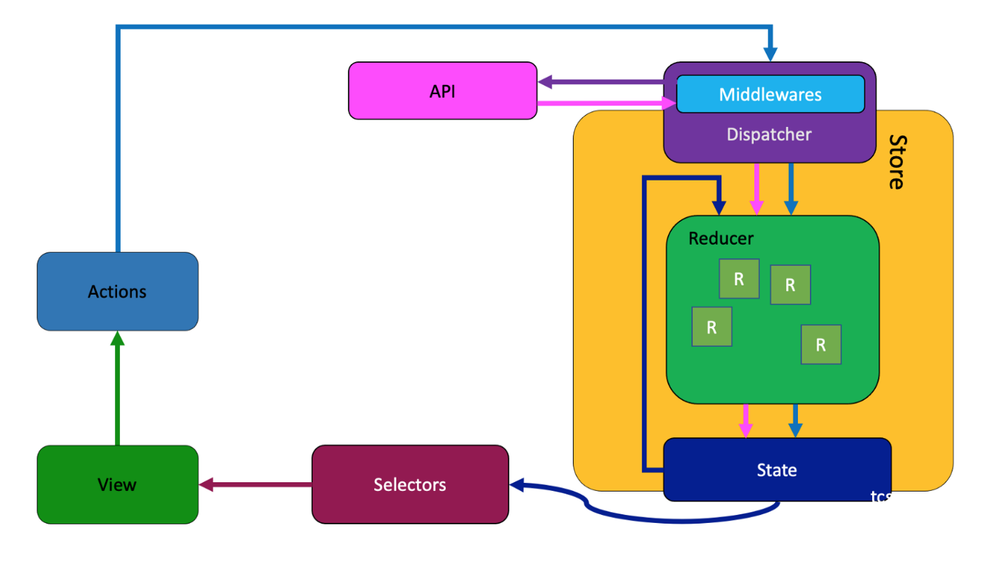
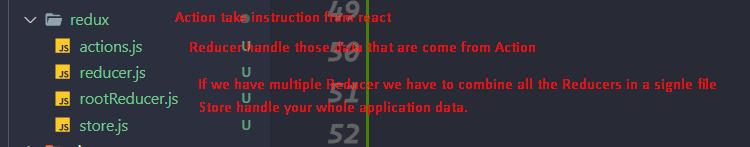

# Redux Saga

### What is Redux?

- A Library for state management
- For Global data management
- A predictable state container
- it's can share data in any component to any component




### What is Saga

- Handle async data in Redux Like APIs
- It can be called middleware
- Middleware between reacting and redux
- Here we can write Async operation like time taking logics and API calls.




### Installing React Redux,Redux and redux-saga

```js
    yarn add redux react-redux redux-saga
```

### Websites

<a href="https://redux.js.org/introduction/getting-started"> Redux </a>
<a href="https://react-redux.js.org/introduction/getting-started"> React Redux </a>
<a href="https://redux-saga.js.org/docs/introduction/GettingStarted/"> Redux Saga </a>

### Setup


Provider : we need provide our application a provider with store
```js
import { Provider } from "react-redux";
import store from "./redux/store";

root.render(
<Provider store={store}>
<App />
</Provider>
);

````

### Action
- Actions are the plain function
- Get data from ReactJS
- Send data to Reducer after process
- Must have type key in return statement
- Must sync type with Reducer

**The example of how action looks like**
*action.js:*
```js
export const ADD_TO_CART = (data) => {
  console.log("add to cart", data);
  return {
    type: "ADD_TO_CART",
    data,
  };
};
````

**The process that how we can call action from our React js**
_app.js_

```js
import { ADD_TO_CART } from "./redux/actions"; // action from action.js
import { useDispatch } from "react-redux"; //useDispatch from react-redux

function App() {
  const dispatch = useDispatch();
  const product = {
    name: "T-Shirt",
    price: "50",
  };
  return (
    <div>
      // Dispatch ADD_TO_CART action with payload
      <button onClick={() => dispatch(ADD_TO_CART(product))}>Click</button>
    </div>
  );
}

export default App;
```
